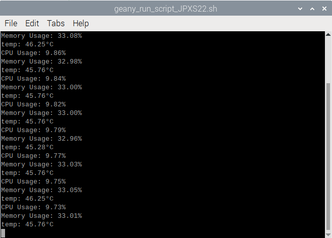

# Pimonitor_temp
라즈베리파이의 CPU, 메모리 모니터링하면서 온도도 추가로 체크해보려고 한다.
라즈베리파이는 높은 성능을 요구하는 작업을 처리할 때 과열 문제를 겪을 수 있기 때문에, 시스템의 안정성을 유지하기 위해 온도를 주기적으로 확인하는 것도 중요하다. 
라즈베리파이의 온도를 지속적으로 모니터링함으로써 이러한 문제를 미리 예방하고 안정적인 작업 환경을 유지할 수 있다.

라즈베리파이는 40°C에서 80°C 사이가 안전하고, 85°C를 넘지 않도록 하는 것이 좋다고 한다.

/sys/class/thermal/thermal_zone0/temp 파일을 통해서 라즈베리파이 내부 온도를 모니터링 할 수 있다.
파일의 예시로는 다음과 같으며 문자열을 정수로 변환하고, 라즈베리파이의 온도 정보가 밀리도섭도(milliCelsius)로 제공되서 도섭도(°C) 로 바꾸었다. 
$ cat /sys/class/thermal/thermal_zone0/temp
45000

